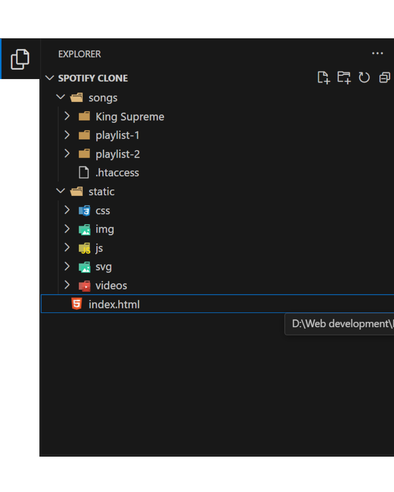

# My Spotify Clone

## Overview

Welcome to the Spotify Clone Project! In this project, I've created a music streaming web application using HTML, CSS, and JavaScript. The design and functionality are inspired by Spotify, allowing users to browse playlists, listen to songs, and control playback.

## Project Structure

- **HTML File:** [`index.html`](index.html)

- **JavaScript Files:**
  - [`script.js`](./static/js/script.js): Handles user interactions, playlist fetching, song playback, and volume control.
  - [`responsive.js`](./static/js/responsive.js): Manages the responsive behavior of the navigation menu.
  - [`serverScript.js`](./static/js/serverScript.js): Contains minor changes for fetching files relative to the server directory.

- **CSS Files:**
  - [`style.css`](./static/css/style.css): Contains the styling for the entire application, including responsive design.

- **Server Files:**
  - `.htaccess`: Configuration file for server settings.
  - `info.json`: Contains metadata for each playlist.
  - `cover.jpeg`: Cover image for playlists.
  - `song.m4a`: Audio files for each song in the playlists.

- **View Live:** [`Spotify Clone`](https://spotifyclonerp.freewebhostmost.com/)

- **Description:** Implements a music streaming service with features like user login, playlist browsing, song playback, and volume control. The design is responsive and user-friendly, providing an engaging experience similar to Spotify.

- **Technologies:** HTML, CSS, JavaScript, Postman

## Contents

1. **User Authentication**
   - Allows users to log in by entering their name. The name is displayed and used throughout the session.

2. **Playlist Browsing**
   - Fetches playlists from the server and displays them on the webpage.
   - Each playlist displays its cover image and title.

3. **Song Playback**
   - Enables users to play, pause, and skip songs within playlists.
   - Displays the current song's details, including the title, artist, and duration.
   - Provides a seek bar to track and control the current playback time.

4. **Volume Control**
   - Allows users to adjust the volume of the currently playing song.
   - Displays volume levels visually and provides a mute/unmute functionality.

5. **Responsive Design**
   - Ensures optimal user experience across various devices with responsive CSS styles.
   - Adjusts the layout and controls for different screen sizes.

## Output Screenshots

**Final Layout**
- Wide Screen View


- Phone Screen View


## Folder Structure
```
├── Spotify Clone
  ├── songs
  │   ├── .htaccess
  │   ├── playlist-1
  │   │   ├── info.json
  │   │   ├── cover.jpeg
  │   │   ├── song1.m4a
  │   │   ├── song2.m4a
  │   ├── playlist-2
  │   │   ├── info.json
  │   │   ├── cover.jpeg
  │   │   ├── song1.m4a
  │   │   ├── song2.m4a
  │   ├── ...
  ├── static
  │   ├── CSS
  │   ├── js
  │   ├── svgs
  │   ├── imgs
  ├── index.html
```



## JavaScript Functions

- **`loginUser`**: Prompts the user to enter their name and displays it.
- **`fetchPlaylists`**: Fetches playlists from the server and displays them.
- **`fetchSongs`**: Fetches songs for a specific playlist and displays them.
- **`findSongDuration`**: Calculates the duration of a song.
- **`playBtnVisibility`**: Toggles the visibility of the play button based on the current song's state.
- **`disableBtn`**: Disables the previous/next buttons.
- **`enableBtn`**: Enables the previous/next buttons.
- **`playSong`**: Handles the logic for playing a song.
- **`seekBarTime`**: Updates the seek bar as the song plays.
- **`playPause`**: Toggles play/pause for the current song.
- **`preNxt`**: Handles the logic for skipping to the previous or next song.
- **`main`**: Main function to initialize event listeners and fetch playlists.
- **`slideDuration`**: Updates the song duration based on the seek bar.
- **`slideVolume`**: Updates the volume based on the volume bar.
- **`intilizeSlideEvents`**: Initializes event listeners for the seek bar and volume bar.
- **`load`**: Loads the DOM and initializes the application.

## CSS Concepts

- **Flexbox**: Used for layout and positioning elements in the application.
- **Responsive Design**: Ensures the application looks good on various devices using media queries.
- **Custom Styling**: Provides a consistent and visually appealing design for the application components.

## Contributions

- **Postman API**
  - Utilized for testing and verifying API endpoints.
  - Ensured seamless fetching of playlists and songs from the server.
  - Facilitated efficient debugging and optimization of server interactions.

## Server-Specific Changes

While uploading files to the server, a few changes were made to ensure the correct relative paths for fetching functions in JavaScript. These changes are included in the `serverScript.js` file located in the `js` folder.

## How to Use

1. Clone the repository: `git clone https://github.com/RahulP-Here/my-web-dev-evolution.git`
2. Navigate to the project directory: `cd spotify-clone`

3. Open [`index.html`](index.html) in a web browser to explore the Spotify Clone.

Feel free to use this project as a template or reference for creating your own music streaming web applications using HTML, CSS, and JavaScript.

---

&copy; HTML|CSS|JS|POSTMANAPI|2024
