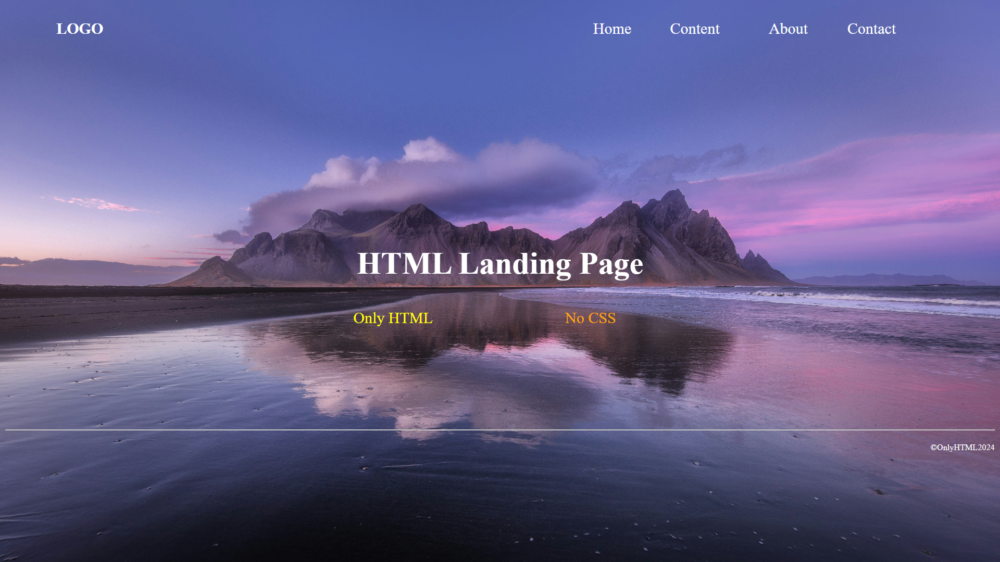

# HTML Landing Page

## Overview

Welcome to my HTML Landing Page project! This page is a simple yet effective landing page created entirely using HTML. It demonstrates the ability to create a basic web page with navigation links and a clean layout using only HTML.

## Project Structure

- **File:** [`landing_page.html`](index.html)
- **View Live:** [`landing_page`](https://rahulp-here.github.io/my-web-dev-evolution.github.io/Project-2/index.html)

- **Description:** A minimalist landing page showcasing the use of HTML for creating a webpage.
- **Language:** Pure HTML

## Contents

1. **HTML Structure**
   - Demonstrates the basic structure of an HTML page, including the DOCTYPE declaration, head, and body.

2. **Background Image**
   - Utilizes a background image for the page, creating an aesthetically pleasing visual experience.

3. **Navigation Bar**
   - Includes a simple navigation bar with links to "Home," "Content," "About," and "Contact."

4. **Page Header**
   - Features a header with a centered title, "HTML Landing Page," styled with a white font.

5. **Key Features**
   - Emphasizes key features using a centered table, showcasing "Only HTML" and "No CSS."

6. **Footer**
   - Adds a footer with a horizontal line and a copyright notice aligned to the right.

## Output Screenshots

1. **Landing Page**

<!-- Add more screenshots for specific sections as needed -->

## How to Use

1. Clone the repository: `git clone https://github.com/RahulP-Here/my-web-dev-evolution.git`
2. Open [`landing_page.html`](./index.html) in a web browser to view the HTML Landing Page.

Feel free to use this landing page as a template or reference for creating HTML-based web pages.

---

&copy; OnlyHTML2024
