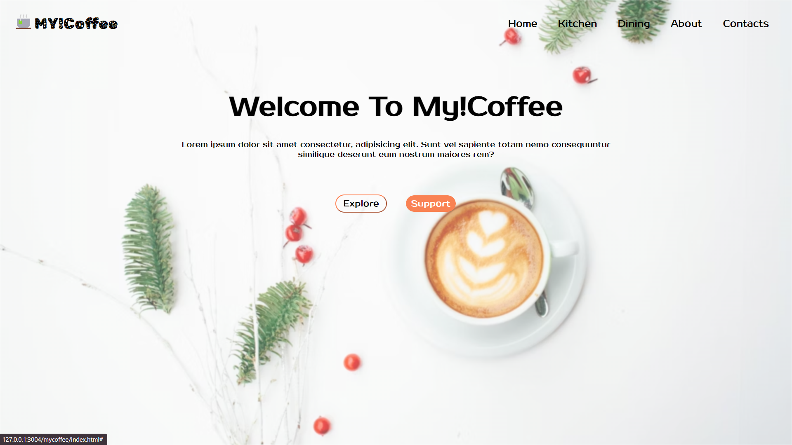

# My Coffee

## Overview

Welcome to My Coffee! This project combines HTML and CSS to create a stylish webpage for a coffee-related website. Explore the simple yet effective design and learn how to use different styling techniques.

## Project Structure

- **HTML File:** [`index.html`](index.html)
- **CSS File:** [`style.css`](style.css)
- **View Live:** [`My Coffee`](https://rahulp-here.github.io/my-web-dev-evolution.github.io/Project-4/index.html)
- **Description:** A webpage introducing My!Coffee with navigation, a welcome message, and buttons for exploration and support.
- **Languages:** HTML, CSS

## Contents

1. **Header Section**
   - Features a logo and a navigation menu with links like Home, Kitchen, Dining, About, and Contacts.
   - Navigation items scale and show an underline on hover.

2. **Main Content**
   - Displays a welcome message and a brief description of the website.
   - Includes buttons for exploration and support, each with a dynamic hover effect.

3. **Styling with CSS**
   - Applies a background image filter to the header section.
   - Uses Google Fonts for unique typography in the logo and the main content.

4. **Responsive Design**
   - Adjusts the layout for different screen sizes to ensure a pleasant viewing experience on various devices.

## Output Screenshots

1. **My Coffee Landing Page**
   

## How to Use

1. Clone the repository: `git clone https://github.com/your-username/my-web-dev-evolution.git`
2. Open [`index.html`](index.html) in a web browser to explore the My Coffee landing page.

Feel free to use this project as a template or reference for creating stylish and responsive web pages using HTML and CSS.

---

&copy; HTMLCSS2024
