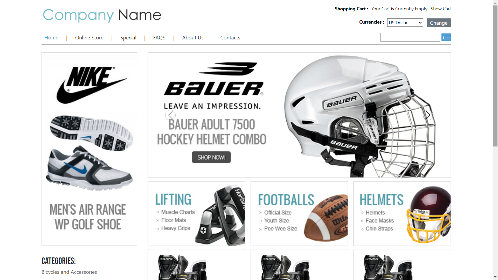
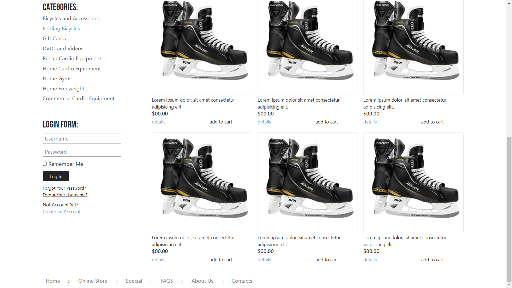

# Design The Layout

## Overview

Welcome to the Layout Design Project! In this project, I've created a responsive webpage layout using HTML, CSS, and Bootstrap. The design is based on a Figma PNG file, and the implementation is done step by step to replicate the provided design.

## Project Structure

- **HTML File:** [`index.html`](index.html)

- **CSS Files:**
  - [`style.css`](./css/style.css)
  - [`utility.css`](./css/utility.css)

- **Bootstrap:**
   - Version 5.3.2 - [Bootstrap CDN](https://cdn.jsdelivr.net/npm/bootstrap@5.3.2/dist/css/bootstrap.min.css)

- **View Live:** [`The Layout.com`](https://rahulp-here.github.io/my-web-dev-evolution.github.io/Project-5/index.html)

- **Description:** Implements a layout with a header, navbar, main page content, and footer. The layout is responsive and follows a clean and modern design, leveraging the Bootstrap framework for enhanced styling and components.

- **Technologies:** HTML, CSS, BOOTSTRAP

## Contents

1. **Header**
   - Displays the company logo on the left and various information like shopping cart status and currency options on the right.

2. **Navbar**
   - Navigation menu with links for Home, Online Store, Special, FAQs, About Us, and Contacts.
   - Includes a search bar with a "Go" button.

3. **Main Page**
   - Divided into left and right sections.
   - Left section features an image, categories list, and a login form.
   - Right section includes a slider, offer cards, and item cards with details.

4. **Styling with CSS and Bootstrap**
   - Utilizes CSS Flexbox for layout and positioning.
   - Implements a responsive design with media queries.
   - Leverages Bootstrap for styling elements and components.

## Output Screenshots

 **Final Layout**
    
    

## How to Use

1. Clone the repository: `git clone https://github.com/RahulP-Here/my-web-dev-evolution.git`

2. Open [`index.html`](index.html) in a web browser to explore the layout.

Feel free to use this project as a template or reference for creating responsive web page layouts using HTML, CSS, and Bootstrap.

---

&copy; HTMLCSSBOOTSTRAP2024