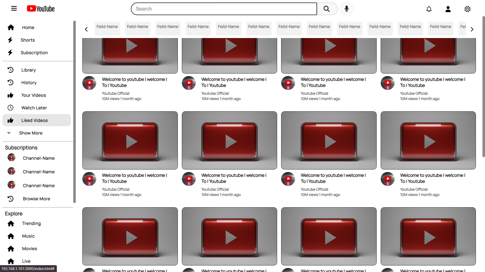
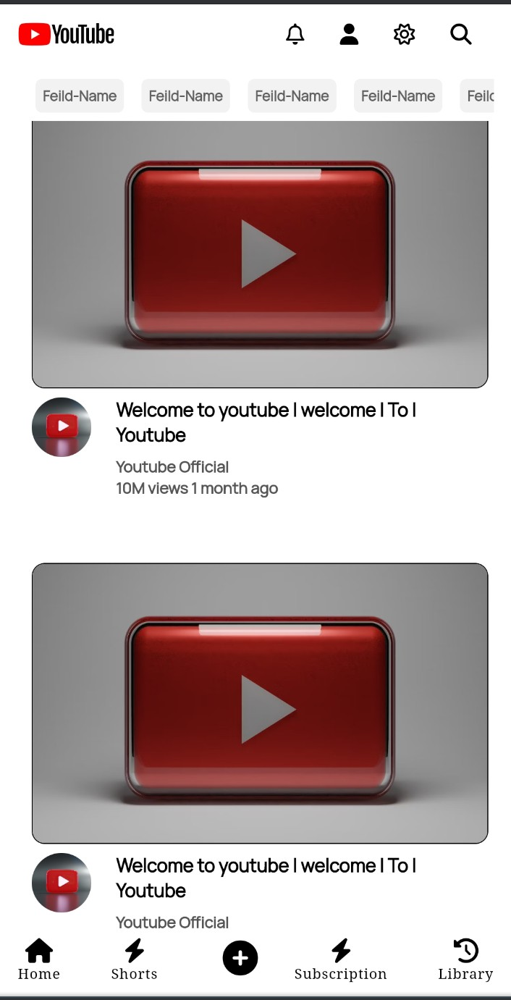

# YouTube Home Page Clone - UI Design

## Overview

Welcome to the YouTube Home Page Clone project! This design-only project aims to replicate the visual appearance of YouTube's home page using HTML and CSS. Dive into the code to explore how the layout, styling, and responsiveness are achieved to mimic the look and feel of the actual YouTube website.

## Project Structure

- **HTML File:** 
  - [`index.html`](index.html)
  
- **CSS Files:**
  - [`style.css`](style.css)
  - [`phone.css`](phone.css)
  - [`responsive.css`](responsive.css)

- **View Live:** [`Youtube.com`](https://rahulp-here.github.io/my-web-dev-evolution.github.io/Project-6/index.html)

- **Description:** The YouTube Home Page Clone project recreates the visual layout of YouTube's home page using HTML and CSS. Explore the code to understand how the project achieves the layout, styling, and responsiveness to closely resemble the original YouTube website.

- **Technologies:** HTML, CSS

## Contents

1. **Top Section**
   - Implements a fixed navigation bar with YouTube logo, search bar, and icons for a familiar user interface.
   - Achieves responsiveness and dynamic styling for optimal viewing on various devices.

2. **Bottom Section**
   - Replicates the bottom section with recommended videos, channels, and a responsive layout for an immersive experience.
   - Utilizes CSS hover effects for an interactive feel.

3. **CSS Styling**
   - Implements a clean and organized CSS structure across multiple files for maintainability.
   - Utilizes CSS features like hover effects, transitions, and media queries for a polished design.

4. **Responsive Design**
   - Adopts a responsive design approach to ensure the YouTube clone is accessible and user-friendly across different devices.
   - Uses media queries in the `phone.css` and `responsive.css` files for adaptability.

## Output Screenshots

1. **Youtube Home Page - Desktop View**

2. **Youtube Home Page - Mobile View**

## Usage

1. Clone the repository: `git clone https://github.com/RahulP-Here/my-web-dev-evolution.git`
2. Open [`index.html`](index.html) in your preferred web browser to view the YouTube Home Page Clone.

Feel free to explore, customize, and use this project as a reference for creating visually appealing and responsive web pages using HTML and CSS.

## Contributions

Contributions are encouraged! If you identify any issues or have suggestions for improvements, please open an issue or submit a pull request.

---

&copy; OnlyHTMLCSS2024
