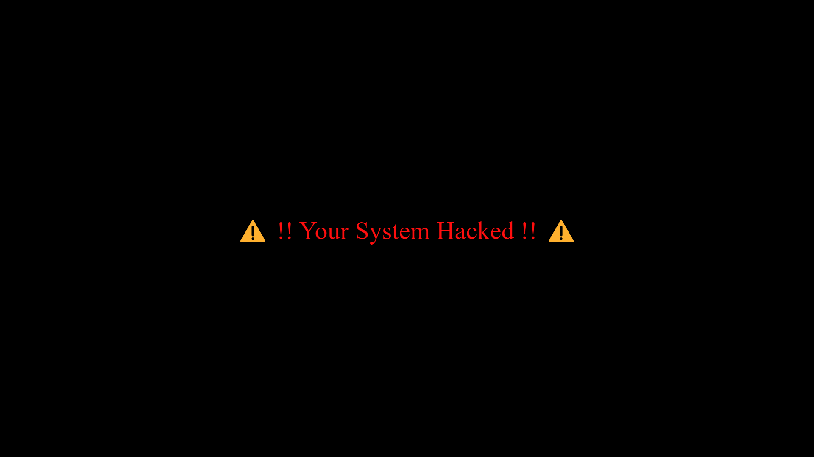

# Hackers Terminal

## Overview

Welcome to Hackers Terminal! This project is a simulation of a hacker terminal interface. Dive into the world of hacking with this stylish and interactive terminal experience.

## Project Structure

- **HTML File:** [`index.html`](index.html)

- **CSS File:** [`style.css`](style.css)

- **JavaScript File:** [`script.js`](script.js)

- **View Live:** [`Hacker-Terminal.com`](https://rahulp-here.github.io/my-web-dev-evolution.github.io/Project-7/index.html)

- **Description:** A simulation of a hacker terminal interface featuring glitch effects, dynamic text animations, and a staged hacking process.
- **Languages:** HTML, CSS, JavaScript

## Contents

1. **Glitch Effect**
   - Utilizes CSS animations to create glitch effects on the terminal interface elements.
   - Glitch effect intensifies on user interaction.

2. **Dynamic Text Animations**
   - Implements JavaScript functions for dynamic text animations like typing effect and staged process updates.

> **Note:** This project also provides an excellent opportunity to practice asynchronous programming concepts in JavaScript, particularly the `async/await` syntax. You can explore how asynchronous tasks are managed using `async` functions and `await` keywords throughout the codebase.

3. **Staged Hacking Process**
   - Simulates a staged hacking process with different phases such as file reading, data transmission, and cleanup.
   - Each stage is visually represented with dynamic text updates and glitch effects.

## Output Screenshots

- 
- 
- 

## How to Use

1. Clone the repository: `git clone https://github.com/RahulP-Here/my-web-dev-evolution.git`
2. Open [`index.html`](index.html) in a web browser to experience the Hackers Terminal simulation.

Feel free to explore the simulated hacking process and the interactive terminal interface. Experiment with the glitch effects and dynamic text animations to create your own immersive experiences.

---

&copy; HTMLCSSJS2024
