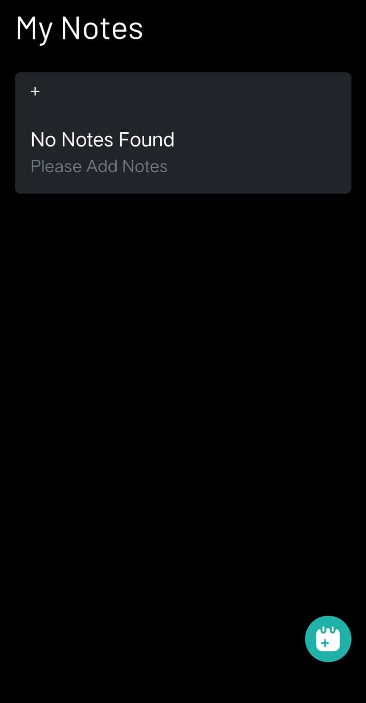
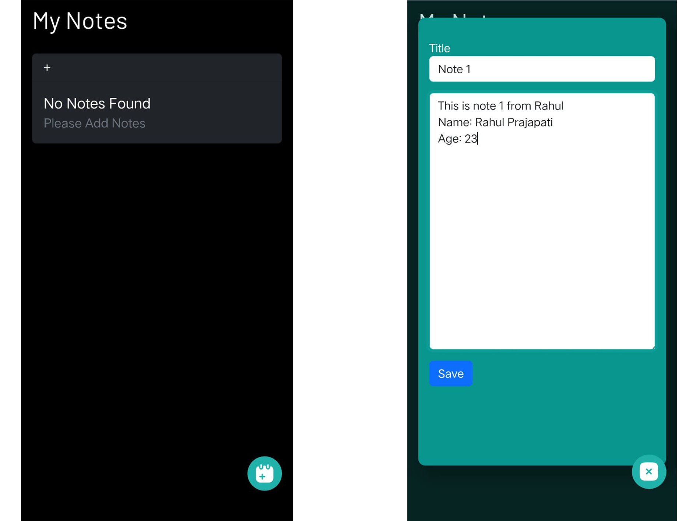
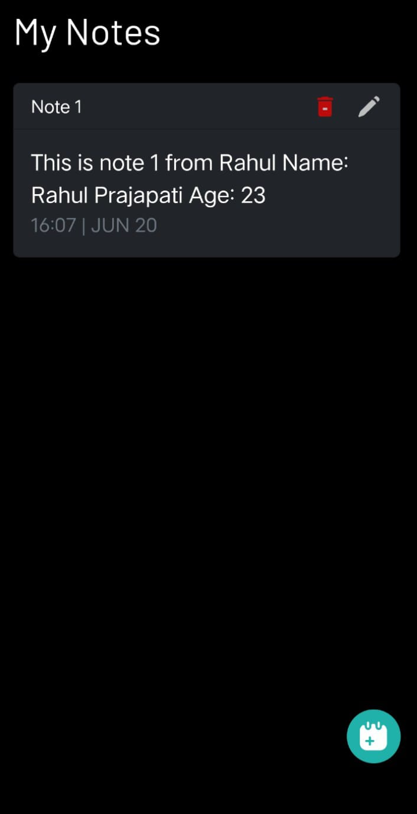

# Notebook App

## Overview

Welcome to Notebook App! This project is a web-based application that allows users to manage notes effectively. It provides features for adding, editing, deleting, and viewing notes, along with a notification system for feedback.

## Project Structure

- **HTML File:** [`index.html`](index.html)

- **CSS File:** [`style.css`](./static/CSS/style.css)

- **JavaScript File:** [`script.js`](./static/JS/script.js)

- **View Live:** [Notebook App](https://rahulp-here.github.io/my-web-dev-evolution.github.io/Project-9/index.html)

- **Description:** Notebook App is designed to offer a simple yet efficient way to manage notes. It uses local storage for data persistence and provides a user-friendly interface for interacting with notes.

- **Languages:** HTML, CSS, JavaScript

## Contents

1. **HTML Structure**
   - Defines the structure of the note-taking interface.
   - Includes input fields, buttons, and containers for displaying notes.

2. **CSS Styling**
   - Styles the application for a clean and intuitive user experience.
   - Uses responsive design principles for compatibility across devices.

3. **JavaScript Functionality**
   - Implements CRUD operations (Create, Read, Update, Delete) for notes.
   - Integrates local storage for data persistence.
   - Provides user feedback through notifications for actions like saving, updating, and deleting notes.

> **Note:** This project demonstrates the use of DOM manipulation and local storage in JavaScript to create an interactive and responsive note-taking application.

## Output Screenshots

- 
- 
- 

## How to Use

1. Clone the repository: `git clone https://github.com/RahulP-Here/my-web-dev-evolution.git`
2. Open [`index.html`](index.html) in a web browser to start using Notebook App.

Explore the functionality of Notebook App by adding, editing, and deleting notes. Experience the seamless user interface designed to enhance note-taking productivity.

---

&copy; Notebook App 2024
